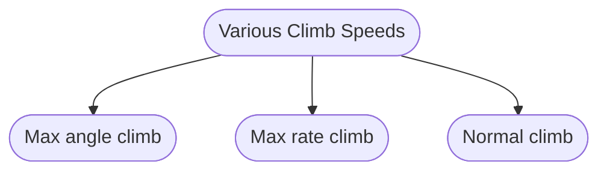

[[PoF]]

Angle of climb - angle between airplane and horisont

Angle climb -> Climb gradient
Rate of climb -> Vertical velocity

```mermaid
flowchart TB

id1([Various Climb Speeds]) --> id2([Max angle climb])

id1([Various Climb Speeds]) --> id3([Max rate climb])

id1([Various Climb Speeds]) --> id4([Normal climb])

```

