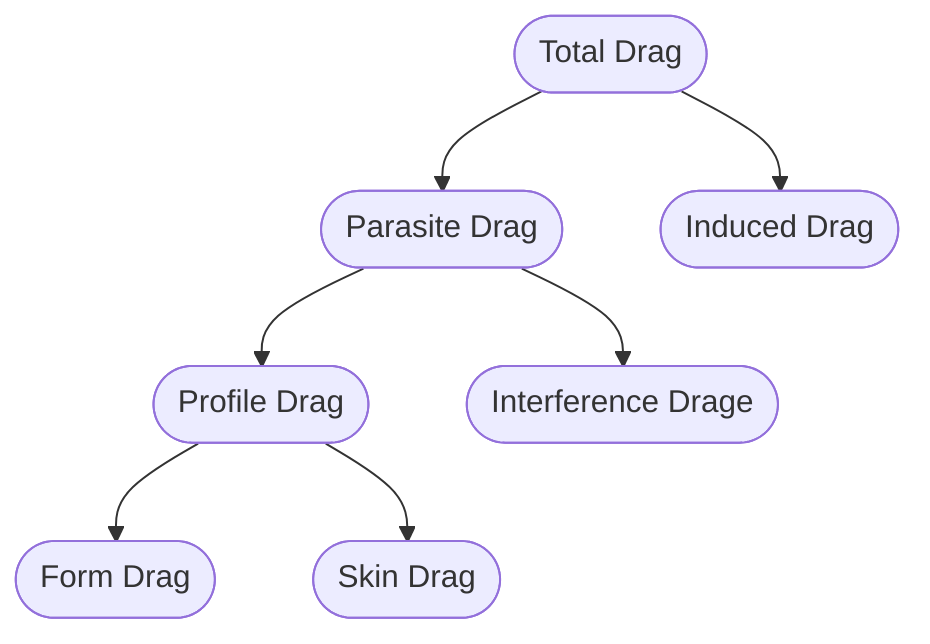

[[PoF]]

# Drag

Drag is [[Aerodynamic forces]] so it has same formula as other aerodynamic forces.
There are 4 main types of drag:
1. [[Form drag]] (Pressure drag, Profile Drag)
2. [[Skin Drag]]
3. [[Interference Drag]]
4. [[Induced Drag]]
